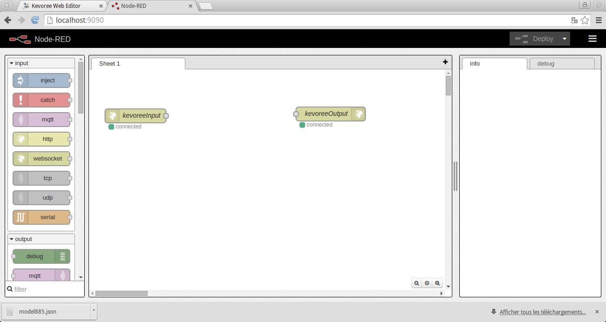

#NodeRed with Kevoree

The goal of this tutorial is to show the integration between NodeRed and Kevoree. For managing this interoperability, we create a NodeRed component. The implementation of this component is specified using NodeRed flow.

This component can also be used to interact with legacy services.

##Step 1:

To use this component you can start a node with a specific kevs

```sh
kevoreejs -n node0 -k step1.kevs
```

The kevs is the following


```kevs
add sync: WSGroup

add node0 : JavascriptNode/5.0.6
add node0.comp831 : NodeRED/2.1.0

set node0.comp831.nodesDir = '/home/k3/tmp'
set node0.comp831.userDir = '/home/k3/tmp1'

attach node0 sync
```

Next go to [http://localhost:9090/](http://localhost:9090/). You can see that we generate two elements in the flow that corresponds to the kevoree input and output ports.



:warning:
If you modify the flow, you must export it in the clipboard, set it to your kevoree model and push it to your nodes.

To do it, go to the top right of your NodeRED UI and select export to the clipboard. Go to your kevoree editor. Select your NodeRED component. Go to the properties view and copy past into the flow property text editor.

##Step 2:

In a second step, we will start a node with a specific flow.

```sh
kevoreejs -n node0 -k step1.kevs
```

Open your browser:
[http://kwe.braindead.fr](http://kwe.braindead.fr)

Pull the model. You can modify it and use it in a distributed and heterogeneous architecture. 

##Step 3:
Build your own flow to get data from your sensor and send them to twitter.
